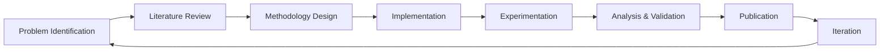

<div align="center">

# Ashim Dhor

**AI Researcher | MS Student at IISER Bhopal**

*Building Trustworthy AI Systems for High-Stakes Healthcare Applications*

<br>

[](https://scholar.google.com/citations?user=KnN80Q4AAAAJ&hl=en)
[](https://ashimdhor.github.io)
[](https://www.linkedin.com/in/ashim-dhor/)
[](mailto:ashimdhor2003@gmail.com)

</div>

---

## 🎓 Academic Profile

**Current Position:** MS Research Scholar, Data Science & Engineering  
**Institution:** Indian Institute of Science Education and Research (IISER) Bhopal  
**Research Lab:** Biomedical Data Science Lab  
**Research Focus:** Trustworthy Vision-Language Models for Cancer Diagnostics

**Collaborations:**
- Jawahar Lal Nehru Cancer Hospital & Research Centre (JNCHRC), Bhopal
- All India Institute of Medical Sciences (AIIMS), Bhopal

---

## 🔬 Research Interests

My research centers on developing reliable and interpretable AI systems for critical healthcare applications, with emphasis on:

```
┌─────────────────────────────────────────────────────────────┐
│  Core Research Areas                                        │
├─────────────────────────────────────────────────────────────┤
│  → Vision-Language Models for Medical Imaging               │
│  → Uncertainty Quantification in Deep Learning              │
│  → Quantum Machine Learning & Algorithms                    │
│  → Computational Pathology & Histopathology Analysis        │
│  → Trustworthy AI & Model Reliability                       │
└─────────────────────────────────────────────────────────────┘
```

**Current Projects:**
- Developing uncertainty-aware VLMs for head & neck cancer diagnosis
- Creating novel whole slide imaging (WSI) datasets for cancer research
- Investigating quantum graph neural networks for molecular analysis

---

## 📚 Publications & Preprints

<div align="left">

> **[Your publications will be listed here]**  
> Include conference papers, journal articles, and preprints with links to arXiv/DOI

</div>

---

## 🛠️ Technical Stack

<div align="center">

### Core Research Tools


### Research Infrastructure


### Specialized Libraries


</div>

---

## 💡 Research Methodology

<div align="center">



</div>

---

## 🤝 Collaboration & Service

**Open to Collaboration On:**

- **Medical AI:** Histopathology analysis, diagnostic systems, multi-modal medical imaging
- **Quantum ML:** Quantum graph networks, variational quantum circuits, hybrid classical-quantum models
- **Trustworthy AI:** Uncertainty quantification, model interpretability, safety-critical AI systems
- **Computer Vision:** Whole slide image analysis, multi-instance learning, attention mechanisms

**Academic Service:**
- Peer review for [conferences/journals]
- Research mentorship for undergraduate students
- Open-source contributions to medical AI tools

---

## 🎯 Research Philosophy

<div align="center">

> *"In high-stakes applications like healthcare, AI systems must not only be accurate—*  
> *they must be trustworthy, interpretable, and aware of their own limitations."*

<br>

**Principles I Follow:**
- **Rigor:** Thorough experimentation and statistical validation
- **Reproducibility:** Open methodologies and well-documented code
- **Ethics:** Responsible AI development with patient safety in mind
- **Collaboration:** Interdisciplinary research with clinicians and domain experts

</div>

---

## 📊 Research Impact

<div align="center">

<table>
<tr>
<td align="center" width="33%">

<br/><sub><b>Peer-Reviewed Papers</b></sub>
</td>
<td align="center" width="33%">

<br/><sub><b>Google Scholar</b></sub>
</td>
<td align="center" width="33%">

<br/><sub><b>Citation Index</b></sub>
</td>
</tr>
</table>

</div>

---

## 📫 Contact & Links

<div align="center">

For research inquiries, collaboration opportunities, or academic discussions:

[](mailto:ashimdhor2003@gmail.com)

[](https://scholar.google.com/citations?user=KnN80Q4AAAAJ&hl=en)
[](https://ashimdhor.github.io)
[](https://www.linkedin.com/in/ashim-dhor/)

<br>

<sub>MS Student in Data Science & Engineering | IISER Bhopal | Biomedical Data Science Lab</sub>

<br>


</div>
