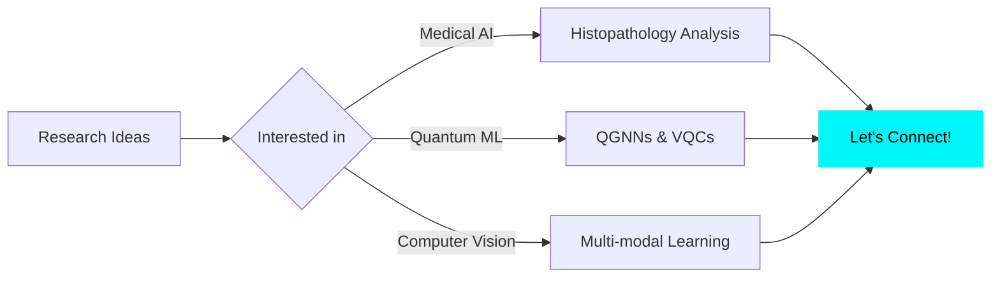

<div align="center">

# `$ whoami`

```ascii
   _____       .__    .__              ________  .__                   
  /  _  \   _____|  |__ |__| _____     \______ \ |  |__   ___________  
 /  /_\  \ /  ___/  |  \|  |/     \     |    |  \|  |  \ /  _ \_  __ \ 
/    |    \\___ \|   Y  \  |  Y Y  \    |    `   \   Y  (  <_> )  | \/ 
\____|__  /____  >___|  /__|__|_|  /   /_______  /___|  /\____/|__|    
        \/     \/     \/         \/            \/     \/                
```

[](https://git.io/typing-svg)


</div>

---

## 🧬 About Me

```python
class AshimDhor:
    def __init__(self):
        self.location = "IISER Bhopal, India 🇮🇳"
        self.education = "BS-MS in Data Science & Engineering"
        self.research_focus = [
            "Vision-Language Models (VLMs)",
            "Quantum Graph Neural Networks",
            "Medical Image Analysis",
            "Uncertainty Quantification"
        ]
        self.current_work = {
            "thesis": "Trustworthy VLMs for Cancer Diagnostics",
            "collaboration": ["JNCHRC Bhopal", "AIIMS Bhopal"],
            "dataset": "Head & Neck Cancer WSI Dataset"
        }
    
    def get_expertise(self):
        return {
            "domains": ["Deep Learning", "Computer Vision", "Quantum ML"],
            "applications": ["Histopathology", "Fraud Detection", "IoT"],
            "focus": "High-stakes AI systems with reliability & safety"
        }
    
    def collaborate_on(self):
        return ["Medical AI", "Quantum Computing", "Multi-modal Learning"]

# Initialize
researcher = AshimDhor()
print(f"🔬 Currently researching: {researcher.current_work['thesis']}")
```

<div align="center">

[](https://www.linkedin.com/in/ashim-dhor/)
[](mailto:ashim21@iiserb.ac.in)
[](https://ashimdhor.github.io)
[](https://scholar.google.com)

</div>

---

## 🎯 Research Highlights

<table>
<tr>
<td width="50%">

### 🧠 Master's Thesis
**Trustworthy VLMs for Cancer Diagnostics**
- 🏥 Collaborating with **JNCHRC** & **AIIMS Bhopal**
- 🔬 Developing novel **Head & Neck Cancer WSI Dataset**
- ⚡ Stress-testing VLMs for **high-stakes medical AI**
- 🛡️ Focus on **safety, reliability & failure mode analysis**

</td>
<td width="50%">

### ⚛️ Quantum ML Research
**Quantum Graph Neural Networks for Fraud Detection**
- 🏆 **Best Project & Presentation Award** at QWorld
- 📊 **94.5% accuracy** (vs 92.4% classical baseline)
- 🔮 Integrated **TDA + VQC** for enhanced learning
- 📈 **0.85 PR-AUC** demonstrating quantum advantage

</td>
</tr>
</table>

---

## 📚 Publications & Submissions

<details open>
<summary><b>📖 Published Research</b></summary>
<br>

**1. Financial Fraud Detection using Quantum Graph Neural Networks**
   - 📰 *Quantum Machine Intelligence* (Published)
   - 👥 Innan, N., Sawaika, A., **Dhor, A.**, et al.
   - 🔗 [View Publication](https://link.springer.com/journal/42484)

</details>

<details>
<summary><b>🚀 Under Review</b></summary>
<br>

**2. Uncertainty-Aware Deep Learning for Gland Segmentation**
   - ✅ *Accepted at IndoML 2025* (BITS Pilani Hyderabad)
   - 📝 Journal submission under review
   - 🎯 Dual uncertainty quantification for histopathology

**3. Topo-GraT: Learning to Grow with Causal Graph Transformers**
   - 📋 *Under review at AAAI-26 Student Abstract*
   - 🌱 Novel approach to causal graph learning

**4. HTG-MIT: AI-Powered Cancer Detection in Medical Images**
   - 📋 *Under review at AAAI-26 Student Abstract*
   - 🏗️ Structure-aware deep learning for cancer detection

**5. REFLEXION: Language Models that Think Twice**
   - 📋 *Under review at ICLR 2026*
   - 🧠 Internalized self-correction in LLMs

</details>

---

## 💻 Tech Stack & Tools

<div align="center">

### 🐍 Languages & Frameworks


### ⚛️ Quantum & ML Frameworks


### 🛠️ DevOps & Tools


</div>

---

## 🚀 Featured Projects

<div align="center">

<table>
<tr>
<td width="50%" valign="top">

### 🩺 HistoAI
**AI-Powered Diagnostic Tool**
```yaml
purpose: Cancer segmentation with uncertainty
award: NBEC 2025 - Second Round Selection
tech: UNet++, Dual Uncertainty Quantification
impact: Improved diagnostic trust in pathology
```
🔗 [View Details](https://drive.google.com/file/d/1khkzdUyoLoZX-g6_r-4iRuJjHI1ynt-C/view)

</td>
<td width="50%" valign="top">

### 🌫️ PAWAMAAN V2
**Smart Air Quality Monitoring**
```yaml
contribution: Oxygen detection with AO-09 sensor
hardware: ESP32C3 microcontroller
innovation: ML-enhanced sensor linearity
deployment: Custom 3D-printed casing
```
🔗 [GitHub](https://github.com/IISERB-UG/Pawamaan---Smart-Air-Quality-Monitoring-System) | [Paper](https://openreview.net/forum?id=I6Eh_2IWxu)

</td>
</tr>
<tr>
<td width="50%" valign="top">

### 💰 Credit Risk Analysis
**Bank Profitability Study**
```yaml
dataset: CMIE data - Indian public banks
methods: Statistical modeling in R/Python
output: Visualizations linking credit & profit
insights: Policy impact on profitability
```
🔗 [GitHub](https://github.com/saisab21/Credit-Risk-Management-and-Its-Impact-on-Indian-Bank-Profitability)

</td>
<td width="50%" valign="top">

### 🔄 CPCR Implementation
**Continual Learning Research**
```yaml
method: Proxy-based Contrastive Replay
dataset: CIFAR-100
achievement: 8.62% end accuracy
focus: Catastrophic forgetting mitigation
```
🔗 [Report](https://drive.google.com/file/d/1GHveS7as15oTIiMtvAXYaDLRbi_wFtM2/view)

</td>
</tr>
</table>

</div>

---

## 🏆 Achievements & Recognition

```diff
+ 🥇 Best Project & Best Presentation Award - QWorld Quantum ML Internship
+ 🧬 Selected for NBEC 2025 Second Round - HistoAI Concept
+ 📊 Reviewer - ML4H Symposium 2025 (The AHLI)
+ 🏅 Sports Secretary - IISER Bhopal (2023-2024)
+ 💼 Student Placement Head - ICDPC, IISER Bhopal (2022-2023)
```

---

## 📊 GitHub Analytics

<div align="center">


</div>

---

## 🤝 Let's Collaborate!

<div align="center">



<br>

**🔬 Open to collaborations in:**
- 🩺 Medical Image Analysis & Trustworthy AI
- ⚛️ Quantum Machine Learning Applications
- 👁️ Computer Vision & Multi-modal Systems
- 🔒 AI Safety & Uncertainty Quantification

<br>

[](https://www.linkedin.com/in/ashim-dhor/)
[](mailto:ashim21@iiserb.ac.in)

</div>

---

<div align="center">

### 💡 Fun Fact
```python
while coffee_level > 0:
    code()
    research()
    innovate()
    if breakthrough:
        publish()
    coffee_level = refill()
```


---

**⭐ From [AshimDhor](https://github.com/AshimDhor) | Building trustworthy AI for healthcare, one model at a time**

</div>

<!-- Snake Animation -->
<picture>
  <source media="(prefers-color-scheme: dark)" srcset="https://raw.githubusercontent.com/AshimDhor/AshimDhor/output/github-contribution-grid-snake-dark.svg">
  <source media="(prefers-color-scheme: light)" srcset="https://raw.githubusercontent.com/AshimDhor/AshimDhor/output/github-contribution-grid-snake.svg">
  
</picture>
